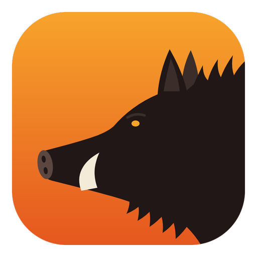
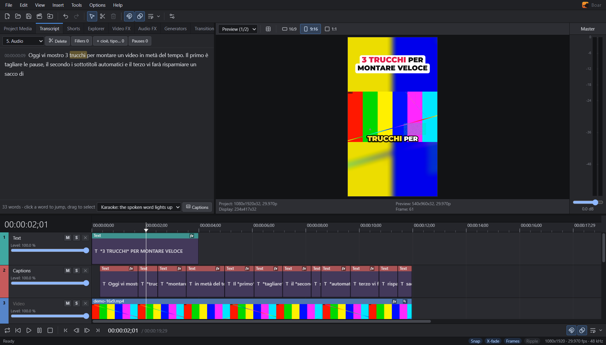

<p align="center"></p>

<h1 align="center">Boar</h1>

<p align="center">
  <b>Editor video desktop con timeline multitraccia e AI che gira sul tuo PC.</b><br>
  Montaggio classico, verticale 9:16, sottotitoli parola per parola, montaggio dal testo e Shorts in un clic.
</p>

<p align="center">
  
  
  
  
</p>

<p align="center">
  <a href="README.md"> English</a> · <a href="README.it.md"> <b>Italiano</b></a>
</p>

<p align="center">
  
</p>

> **Alpha.** Si usa già per montare davvero, ma è giovane: salva spesso e segnala quello che non va.

## Perché Boar

- **Tutto in locale.** Trascrizione, riconoscimento del volto, rimozione dello sfondo, scontorno degli oggetti e riduzione del rumore girano sul tuo PC. Niente account, niente abbonamenti, niente caricato online.
- **Nessuna raccolta di dati.** Niente statistiche, log d'uso o telemetria, nemmeno dalle librerie che usa: Boar blocca ogni connessione tranne i download che chiedi tu (aggiornamenti, modelli vocali, yt-dlp). Il controllo degli aggiornamenti si spegne in *Options*.
- **Pensato per i video di oggi.** Formato verticale, sottotitoli animati parola per parola, titoli d'aggancio, zoom sui tagli, dal video lungo agli Shorts.
- **Montaggio vero.** Timeline multitraccia con eventi, fade e dissolvenze, selezione temporale, ripple, keyframe, effetti e transizioni.
- **Veloce sul tuo hardware.** Export con l'encoder hardware della scheda video (Intel, NVIDIA o AMD), effetti sulla GPU. I video lenti da scorrere (registrazioni dello schermo con keyframe distanti secondi, 4K) ricevono in background un **proxy** leggero, così l'anteprima resta istantanea; il render usa sempre l'originale.
- **Il tuo agente AI può montare con te.** Se usi già un assistente AI compatibile con MCP, può tagliare, sottotitolare e fare Shorts dentro Boar con il tuo piano, senza chiavi o costi in più.

## Funzioni

### Montaggio

- Timeline multitraccia: trascina i media da Project Media o da Esplora file; video e audio di una clip restano raggruppati.
- Trim dai bordi, **fade dagli angoli** dell'evento (curve Fast, Linear, Slow, Smooth, Sharp), crossfade automatico sovrapponendo due eventi.
- **Selezione temporale**: trascina sul righello per lavorare su una porzione: split, elimina, trim, play e render solo di quella parte.
- **Auto Ripple** (`Ctrl+L`): eliminando, tagliando o incollando i buchi si chiudono da soli, sulle tracce interessate o su tutte.
- **Velocità**: `Ctrl` + trascina un bordo per accelerare o rallentare (0.25x–4x, l'audio mantiene l'intonazione).
- Split, gruppi, marker, snapping, quantizzazione ai frame, menu contestuali e 200 livelli di annulla.
- **Anteprima a schermo intero** (`F`): rivedi il montaggio senza distrazioni, con barra di avanzamento e marker al volo (`M`).
- **Ricerca comandi** (`Ctrl+F`): scrivi quello che ti serve ("export", "subtitles", "blur") per trovare e lanciare qualsiasi comando dei menu, opzione, pannello, effetto o titolo.

### Verticale e social

- Progetto 16:9, **9:16** o 1:1 con un clic, safe area delle app nell'anteprima.
- **Auto Reframe**: trova il volto e muove l'inquadratura per seguirlo, con un movimento morbido.
- **Layout**: sfondo sfocato (niente bande nere con il 16:9 in verticale), schermo diviso sopra/sotto, riquadro nell'angolo.
- **Auto Zoom**: zoom alternato a ogni taglio, zoom rapido sui momenti più forti della voce o lento avvicinamento.
- **Da video lungo a Shorts** (tab *Shorts*): Boar propone i momenti che funzionano da soli e *Make Short* crea il video verticale con taglio, inquadratura, sottotitoli e titolo d'aggancio. Un clic e torni al video lungo per fare il prossimo.

### Sottotitoli e testo

- **Sottotitoli automatici parola per parola** con Whisper, in locale: karaoke, box sulla parola, parole che compaiono, una parola alla volta, sottotitoli classici.
- **Montaggio dal testo** (tab *Transcript*): il parlato diventa testo; selezioni le parole, premi `Canc` e il video si taglia. Un pulsante seleziona ehm, uhm e parole ripetute; un altro accorcia le pause lunghe.
- Parole chiave evidenziate (`*parola*` nel testo, o in automatico) ed emoji sulle parole a tema.
- 21 preset di testo, tra cui titolo d'aggancio in alto e progress bar; oltre 30 font inclusi; animazioni di entrata e uscita.
- Maniglie direttamente nell'anteprima per spostare, scalare e ruotare testi, immagini e video (per ruotare trascina appena fuori da un angolo, Shift per scatti di 15°).

### Audio

- **Volume uniforme**: l'export è normalizzato a −14 LUFS (o −16, −23), con limiter sui picchi.
- **Riduzione del rumore con AI** in locale, noise gate, equalizzatore a 10 bande, compressore, riverbero, eco, pitch e altri effetti.
- **Rimozione silenzi** (jump cut): le pause da tagliare compaiono in rosso sulla timeline mentre regoli. **Auto Ducking**: la musica si abbassa quando qualcuno parla.
- Mixer con volume, pan, mute e solo per traccia, meter master.

### Effetti, transizioni, export

- 24 effetti video sulla GPU: look colore pronti, correzione colore, chroma key, sfocatura, glow, vignettatura, grana, VHS, glitch e altri. **Rimozione dello sfondo** con AI, senza green screen.
- Transizioni: zoom, whip pan, spin, glitch, flash, dissolvenza al nero, blur, pixel.
- Maschere: ellisse, rettangolo o forma custom disegnata a punti e animata con i keyframe. **Smart Select** scontorna un oggetto con un clic (altri clic aggiungono o tolgono parti) e *Track Motion* lo segue per tutta la clip.
- Event Pan/Crop con keyframe.
- **Render As** in MP4 (H.264, HEVC, AV1, VP9): scegli chi codifica, la scheda video (NVENC, Quick Sync, AMF, VideoToolbox) o il processore, e l'audio (AAC o Opus). L'anteprima e l'export usano lo stesso motore: quello che vedi è quello che esporti.

## Installazione

### Windows

1. Scarica `Boar-Setup-x.y.z.exe` dalla pagina [Releases](https://github.com/MatteoFilosa/boar/releases) e avvialo.
2. L'installer non è ancora firmato: se Windows SmartScreen mostra "PC protetto", clicca *Ulteriori informazioni › Esegui comunque*.

### macOS (sperimentale)

1. Scarica `Boar-x.y.z-arm64.dmg` (Apple Silicon) o `Boar-x.y.z-x64.dmg` (Intel) dalla pagina [Releases](https://github.com/MatteoFilosa/boar/releases), aprilo e trascina Boar in Applicazioni.
2. Boar non è firmato con un Apple Developer ID, quindi macOS blocca il primo avvio: apri *Impostazioni di Sistema › Privacy e sicurezza* e clicca *Apri comunque*. Oppure, nel Terminale: `xattr -dr com.apple.quarantine /Applications/Boar.app`.

### Linux (sperimentale)

- **Debian, Ubuntu e derivate**: scarica `Boar-x.y.z-amd64.deb` e installalo con `sudo apt install ./Boar-x.y.z-amd64.deb`.
- **Qualsiasi distribuzione**: scarica `Boar-x.y.z-x86_64.AppImage`, rendilo eseguibile (`chmod +x`) e avvialo. Su Ubuntu 24.04 e successivi una restrizione di sistema può impedire l'avvio di AppImage di questo tipo: lì usa il .deb.

### Aggiornamenti

All'avvio Boar controlla se c'è una nuova versione e propone di installarla: su Windows e con l'AppImage si aggiorna da solo e riparte; su macOS e con il .deb scarica il nuovo file da installare. *Help › Check for Updates* controlla quando vuoi, *Options › Check for Updates at Startup* disattiva il controllo all'avvio.

### Sottotitoli e Transcript

Il riconoscimento vocale ([whisper.cpp](https://github.com/ggml-org/whisper.cpp)) è integrato in Boar: non serve installare nient'altro. La prima volta l'app scarica il modello Whisper che scegli (148 MB per il più leggero).

### Dai sorgenti

Serve [Node.js](https://nodejs.org/) 22 o più recente.

```bash
git clone https://github.com/MatteoFilosa/boar.git
cd boar
npm install
npm run whisper
npm run dev
```

`npm run whisper` mette in `resources/whisper` il motore vocale per il tuo sistema, preso dall'ultima build della CI (serve la [GitHub CLI](https://cli.github.com/) con login). In alternativa `bash scripts/build-whisper.sh` lo compila (CMake, un compilatore C++ e, su Windows e Linux, il Vulkan SDK). `npm run dist` crea l'installer in `dist/`.

## Schede video

Boar funziona con GPU **Intel, NVIDIA e AMD**: non c'è codice legato a un produttore.

| Cosa | Come |
| --- | --- |
| Export | WebCodecs: l'encoder della scheda video (NVENC su NVIDIA, Quick Sync su Intel, AMF su AMD, VideoToolbox su Mac) o quello software sul processore, come scegli in *Render As*, che indica per ogni formato cosa sa fare la tua macchina. HEVC e AV1 sulla scheda dipendono dalla sua generazione; su Linux spesso l'export usa il processore, più lento. |
| Anteprima ed effetti | WebGL2, uguale su tutte le GPU recenti. |
| Volto, sfondo e Smart Select (AI) | MediaPipe sulla GPU, con ripiego sul processore. |
| Trascrizione | whisper.cpp integrato in Boar: sulla GPU con Vulkan (Windows, Linux) o Metal (macOS), altrimenti sul processore. |
| Riduzione del rumore | Sul processore, identica ovunque. |

Con driver video aggiornati va tutto meglio, soprattutto per l'encoder hardware.

## Agenti AI (MCP)

Gli assistenti e gli agenti AI compatibili con MCP (app desktop, agenti di coding, editor AI) possono usare Boar con il tuo abbonamento: Boar non chiede chiavi API e non costa nulla in più.

1. In Boar attiva *Options › AI Agents (MCP)*. Il server ascolta solo su questo PC ed è protetto da un token.
2. Copia la configurazione adatta al tuo agente: URL con header, comando (JSON) o TOML.
3. Chiedi, per esempio: "togli gli intercalari e aggiungi i sottotitoli", oppure usa i prompt pronti *make_shorts*, *clean_up_talking_head* e *youtube_chapters*.

L'agente legge la timeline e le trascrizioni, guarda i frame e fa le modifiche: ognuna si annulla con `Ctrl+Z` e la finestra mostra tutto quello che ha fatto. Video e audio restano sul tuo PC.

## Temi

*Options › Themes* passa tra **Dark**, **Light**, **Galaxy** ed **Ember** e carica temi fatti da chiunque. Un tema è un piccolo file JSON: ogni chiave di `colors` è un colore dell'interfaccia (qualsiasi colore CSS, anche `rgba()`), e quelli che ometti vengono da `base`. Un colore trasparente lascia vedere il gradiente di `backdrop` dietro i pannelli.

```json
{
  "boarTheme": 1,
  "name": "Sunset",
  "author": "Il tuo nome",
  "base": "dark",
  "colors": {
    "accent": "#ff6a3d",
    "bg": "#1a1418",
    "panel": "#241c21",
    "timeline-bg": "#1c1619",
    "track-a": "#2a2026",
    "track-b": "#251c21"
  },
  "backdrop": { "gradient": "linear-gradient(160deg, #1a1418, #3a1f2b)", "stars": false }
}
```

Il modo più veloce per crearne uno: scegli il tema più vicino a quello che vuoi, premi *Export Theme* (il file elenca tutti i colori con il loro nome), cambia quello che ti piace e caricalo con *Load Theme File* o trascinandolo sulla finestra. I file dei temi sono solo dati: non possono caricare immagini, font o altro da internet. Anche un agente AI collegato via MCP può crearne uno per te con il tool `set_theme`.

## Funzioni opzionali

**Download da link (yt-dlp).** Spento di default: si attiva da *Options*. Scarica video o audio dai siti supportati da [yt-dlp](https://github.com/yt-dlp/yt-dlp), che non è incluso in Boar e viene scaricato al primo uso. La finestra resta aperta accanto alla timeline: *Download and Add to Timeline* mette il file al cursore, oppure lo trascini dalla finestra. Dalla maggior parte dei siti video e audio arrivano separati e Boar li unisce da solo, quindi FFmpeg non serve. Scarica solo contenuti che hai il diritto di usare: i termini di molti siti vietano il download.

## Scorciatoie

| Tasto | Azione |
| --- | --- |
| `Spazio` / `Invio` | play e pausa (in *Options* Spazio può tornare al punto di partenza) |
| `F` / `F11` | anteprima a schermo intero (`Esc` per uscire) |
| `S` | split al cursore o ai bordi della selezione temporale |
| `Canc` / `Shift+Canc` | elimina / elimina e chiudi il buco |
| `Ctrl+T` | tieni solo la selezione temporale |
| `Ctrl+L` | Auto Ripple |
| `Ctrl` + trascina un bordo | cambia velocità |
| `Ctrl+Z` / `Ctrl+Y` | annulla / ripeti |
| `Ctrl+C` / `Ctrl+X` / `Ctrl+V` | copia / taglia / incolla (anche immagini dagli appunti) |
| `Ctrl+S` / `Ctrl+O` | salva / apri progetto (`.boar`) |
| `Ctrl+M` | Render As |
| `Ctrl+F` | cerca comandi, opzioni ed effetti |
| `Ctrl+R` / `Ctrl+Shift+R` | ruota video, immagine o testo selezionato di 90° in senso orario / antiorario |
| `M`, `G` / `U`, `F8`, `Q` | marker, raggruppa / separa, snapping, loop |
| `←` `→` / `↑` `↓` | frame precedente e successivo / zoom |
| `Esc` | togli la selezione temporale |

Su Mac usa ⌘ al posto di Ctrl e ⌥ al posto di Alt. Elenco completo in *Help › Keyboard Shortcuts*.

## Per sviluppatori

| Comando | Cosa fa |
| --- | --- |
| `npm run dev` | app con hot reload |
| `npm run dev:web` | solo interfaccia nel browser (http://localhost:5180) |
| `npm run samples` | genera media di prova in `dev-samples/` (serve FFmpeg) |
| `npm run whisper` | scarica il motore vocale per il tuo sistema dall'ultima build della CI |
| `npm run typecheck` | controllo TypeScript |
| `npm run smoke` | build e avvio nascosto: errori, encoder hardware, protocollo media |
| `npm run icons` | rigenera le icone da `resources/icon.svg` |
| `npm run dist` | installer per il tuo sistema in `dist/` (GitHub Actions crea i tre installer a ogni release) |

Stack: Electron, React, TypeScript, zustand e immer, [Mediabunny](https://github.com/Vanilagy/mediabunny) per decodifica, codifica e MP4 con WebCodecs.

- `src/main`: processo principale (finestra, file, protocollo `boar-media://`, trascrizione, server MCP)
- `src/renderer/src/core`: modello del progetto, azioni con annulla, testo, Pan/Crop, trascrizioni
- `src/renderer/src/engine`: compositor condiviso da anteprima ed export, effetti, audio, analisi
- `src/renderer/src/ui`: interfaccia e timeline su canvas
- `src/renderer/src/agent`: strumenti e prompt per gli agenti AI

Il tempo è un intero in *flicks* (1/705.600.000 di secondo): tutti i frame rate comuni, NTSC compresi, cadono su valori esatti.

## Licenza

[MIT](LICENSE) © Matteo Filosa. Il nome Boar e il logo non sono coperti dalla licenza. Componenti di terze parti: [THIRD_PARTY_NOTICES.md](THIRD_PARTY_NOTICES.md).
